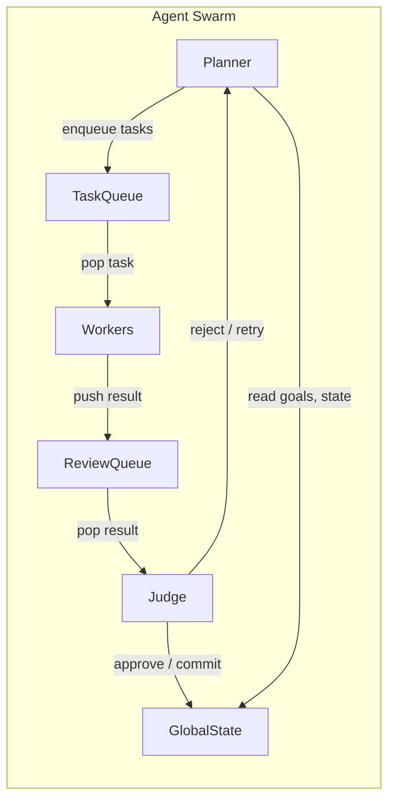
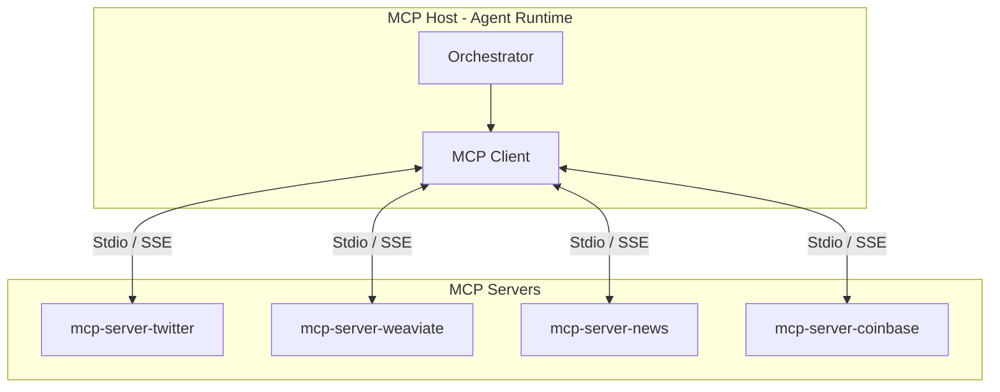
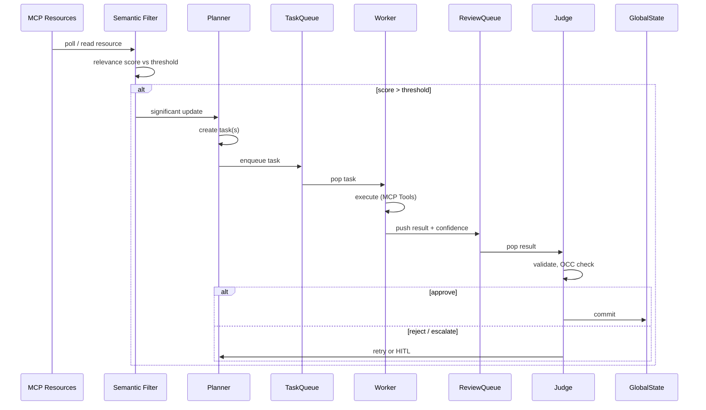

# Project Chimera — Domain Architecture Strategy

**Purpose:** Architectural decisions and rationale for the Autonomous Influencer Network.  
**References:** [SRS §2–3](../docs/Project%20Chimera%20SRS%20Document_%20Autonomous%20Influencer%20Network.md), [Technical Report](../technical_report.md).

---

## 1. Agent Pattern: Hierarchical Swarm (FastRender)

**Recommendation:** Use the **FastRender** hierarchical swarm — Planner / Worker / Judge — as the core agent pattern.

**Rationale:**

- **SRS §3.1** defines the system around three roles: Planner (strategist), Worker (executor), Judge (gatekeeper). This is not a sequential chain but a swarm with a clear hierarchy and queues.
- **Technical report:** Chimera is orchestration-first; a16z and multi-agent literature indicate that multi-agent systems outperform single monoliths for complex, parallel workloads.
- **Scalability:** Workers are stateless and share-nothing; the Planner can enqueue many tasks in parallel. Judge centralises quality and governance without blocking Workers.

**Alternatives considered:**

- **Sequential chain:** Rejected — does not support parallel execution or clear separation of planning vs execution vs validation.
- **Flat swarm:** Rejected — no single point for plan decomposition and OCC; would complicate HITL and budget governance.

---

## 2. Human-in-the-Loop (HITL): Judge Layer

**Recommendation:** HITL is implemented at the **Judge** layer only. No human approval inside Planner or Worker execution paths.

**Logic (per SRS §5.1):**

| Confidence score | Action |
|------------------|--------|
| **> 0.90** | Auto-approve; commit to GlobalState and proceed. |
| **0.70 – 0.90** | Async approval; task added to Orchestrator Dashboard queue; human Approve/Reject later. |
| **< 0.70** | Reject; signal Planner to retry with refined prompt or strategy. |

**Additional rule:** Regardless of score, content that triggers **sensitive topic filters** (Politics, Health Advice, Financial Advice, Legal Claims) MUST be routed to the HITL queue for mandatory human review.

**Safety layer placement:** The Judge is the only component that can commit Worker results to GlobalState; therefore it is the single enforcement point for HITL and confidence thresholds.

---

## 3. Database: SQL (PostgreSQL) + Weaviate + Redis

**Recommendation:**

- **Transactional and high-velocity metadata:** **PostgreSQL (SQL)**. Use for: campaigns, tasks, video metadata, audit logs, user/tenant data. Rationale: strong consistency, ACID, mature tooling, and the SRS §2.3 explicitly calls out PostgreSQL for “user data, campaign configurations, and operational logs.” High-velocity video metadata (e.g. asset records, status, platform) fits this model.
- **Semantic memory:** **Weaviate** (vector DB). Per SRS §2.3 and FR 1.1: agent memories, persona definitions, and world knowledge. Used for RAG and long-term recall.
- **Queues and episodic cache:** **Redis**. Per SRS §2.3: short-term memory and task queuing (TaskQueue, ReviewQueue, episodic window). Celery/BullMQ can sit on top.

**Why SQL over NoSQL for video metadata:** Video asset records require relational integrity (agent_id, campaign_id, character_reference_id), status transitions, and auditability. PostgreSQL supports JSONB for flexible metadata while keeping a clear schema; clustering and read replicas address high velocity. NoSQL would spread consistency and schema discipline across application code.

---

## 4. Architecture Diagrams

### 4.1 FastRender Swarm (Planner → TaskQueue → Workers → ReviewQueue → Judge → GlobalState)

### 4.2 MCP Hub-and-Spoke (Orchestrator / MCP Host ↔ MCP Servers)

### 4.3 Data Flow: Perception → Filter → Planner → Worker → Judge

---

## 5. Summary

| Decision | Choice | Rationale |
|----------|--------|-----------|
| Agent pattern | Hierarchical Swarm (FastRender) | SRS §3.1; orchestration-first; parallel Workers; single Judge for governance. |
| HITL | Judge layer only | Single gatekeeper; confidence tiers and sensitive-topic override per SRS §5.1. |
| Transactional DB | PostgreSQL (SQL) | Campaigns, tasks, video metadata, audit; ACID and relational integrity. |
| Semantic memory | Weaviate | SRS §2.3, FR 1.1; RAG and long-term agent memory. |
| Queues / episodic | Redis | SRS §2.3; TaskQueue, ReviewQueue, short-term cache. |

This strategy keeps the codebase aligned with the SRS and positions Chimera as an orchestration-first, agent-native node suitable for future OpenClaw-style agent social networks.
