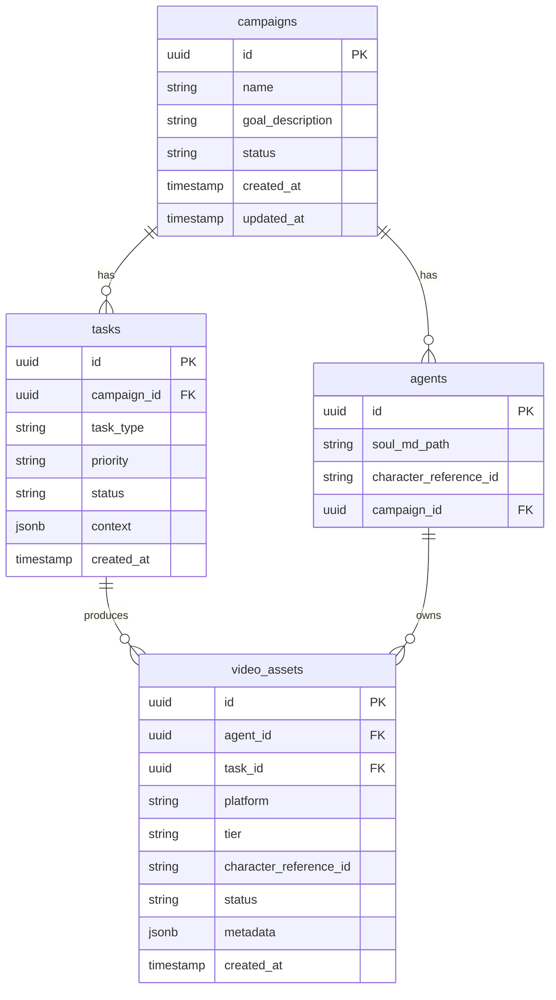

# Technical Specification — Project Chimera

API contracts (JSON), database ERD for video metadata and related entities, and references to MCP tool definitions. All implementation and tests MUST conform to these contracts.

**Source:** SRS §6.2 Data Models & Schemas; [functional.md](functional.md).

---

## 1. Agent Task (Planner → Worker)

Payload passed from Planner to Worker via TaskQueue. **SRS §6.2 Schema 1.**

```json
{
  "task_id": "uuid-v4-string",
  "task_type": "generate_content | reply_comment | execute_transaction",
  "priority": "high | medium | low",
  "context": {
    "goal_description": "string",
    "persona_constraints": ["string"],
    "required_resources": ["mcp://twitter/mentions/123", "mcp://memory/recent"]
  },
  "assigned_worker_id": "string",
  "created_at": "timestamp",
  "status": "pending | in_progress | review | complete"
}
```

| Field | Type | Description |
|-------|------|-------------|
| `task_id` | string (UUID v4) | Unique task identifier. |
| `task_type` | enum | One of: `generate_content`, `reply_comment`, `execute_transaction`. |
| `priority` | enum | `high`, `medium`, `low`. |
| `context` | object | `goal_description`, `persona_constraints` (list of strings), `required_resources` (list of MCP resource URIs). |
| `assigned_worker_id` | string | Worker instance identifier (optional at enqueue time). |
| `created_at` | timestamp | ISO 8601 or Unix ms. |
| `status` | enum | `pending`, `in_progress`, `review`, `complete`. |

---

## 2. Worker Result (Worker → Judge)

Payload pushed to ReviewQueue after a Worker completes a task.

```json
{
  "task_id": "string",
  "status": "success | failure",
  "artifact": "object | string | null",
  "confidence_score": 0.0,
  "reasoning_trace": "string",
  "created_at": "timestamp"
}
```

| Field | Type | Description |
|-------|------|-------------|
| `task_id` | string | Must match the Task that was executed. |
| `status` | enum | `success` or `failure`. |
| `artifact` | object / string / null | Output (e.g. generated text, image URL, transaction hash). |
| `confidence_score` | float | 0.0–1.0; used by Judge for HITL routing. |
| `reasoning_trace` | string | Optional explanation for auditing. |
| `created_at` | timestamp | When the result was produced. |

---

## 3. Trend API Contract

Used by trend-fetching skills and tests. Input and output shapes.

**Input (e.g. to trend fetcher):**

| Field | Type | Description |
|-------|------|-------------|
| `resource_uri` | string | MCP resource URI (e.g. `news://ethiopia/fashion/trends`). |
| `time_range_hours` | number (optional) | Lookback window. |

**Output (list of trend items):**

Each item in the returned list MUST have at least:

| Field | Type | Description |
|-------|------|-------------|
| `id` | string | Unique identifier for the trend item. |
| `title` | string | Short title or headline. |
| `relevance_score` | float | 0.0–1.0. |
| `source` | string | Source identifier or URI. |
| `timestamp` | string | ISO 8601 or Unix ms. |

Example:

```json
[
  {
    "id": "trend-001",
    "title": "Summer fashion drop",
    "relevance_score": 0.85,
    "source": "news://ethiopia/fashion",
    "timestamp": "2026-02-04T12:00:00Z"
  }
]
```

---

## 4. Database ERD: Video Metadata and Related Entities

High-velocity video metadata and agent outputs are stored in **PostgreSQL**. Semantic memory remains in Weaviate; queues in Redis.

### 4.1 Entity-Relationship Diagram (Mermaid)



### 4.2 Table: `video_assets`

Stores metadata for generated video (and optionally image) assets. Supports Tier 1 (image-to-video) and Tier 2 (text-to-video) per SRS FR 3.2.

| Column | Type | Description |
|--------|------|-------------|
| `id` | UUID PK | Primary key. |
| `agent_id` | UUID FK → agents | Owning Chimera agent. |
| `task_id` | UUID FK → tasks | Task that produced this asset. |
| `platform` | string | Target platform (e.g. instagram, tiktok). |
| `tier` | string | `tier1` (daily / image-to-video) or `tier2` (hero / text-to-video). |
| `character_reference_id` | string | Consistency lock per SRS FR 3.1. |
| `status` | string | e.g. `draft`, `judge_pending`, `approved`, `published`, `rejected`. |
| `metadata` | JSONB | Flexible fields (duration, resolution, external_url, etc.). |
| `created_at` | timestamp | Creation time. |

### 4.3 Tables: `campaigns`, `agents`, `tasks`

- **campaigns:** id, name, goal_description, status, created_at, updated_at.
- **agents:** id, soul_md_path, character_reference_id, campaign_id (FK).
- **tasks:** id, campaign_id (FK), task_type, priority, status, context (JSONB), created_at. Persisted mirror of the in-queue Task payload for audit and replay.

---

## 5. MCP Tool Definitions

MCP Tools used by Workers are defined by the respective MCP Servers. This repo does not redefine them; the SRS §6.2 **Schema 2** exemplifies a Social Post tool:

- **Name:** e.g. `post_content`
- **Description:** Publishes text and media to a connected social platform.
- **inputSchema:** JSON Schema with properties such as `platform`, `text_content`, `media_urls`, `disclosure_level`; `required`: `["platform", "text_content"]`.

Skill READMEs under `skills/` define the **runtime skill** input/output contracts that wrap or use these MCP tools. Tests assert that skill interfaces accept the parameters defined in those READMEs and that trend output conforms to the Trend API contract above.
