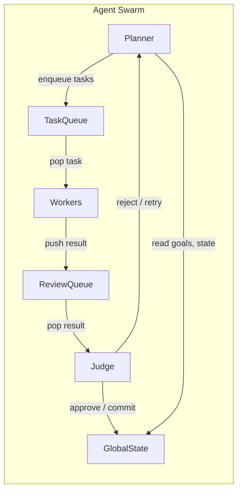
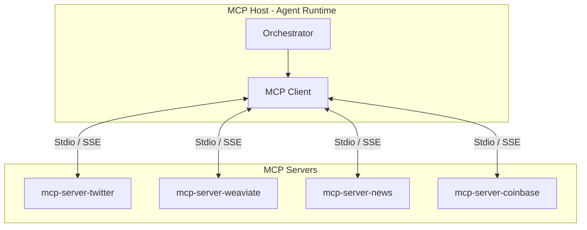
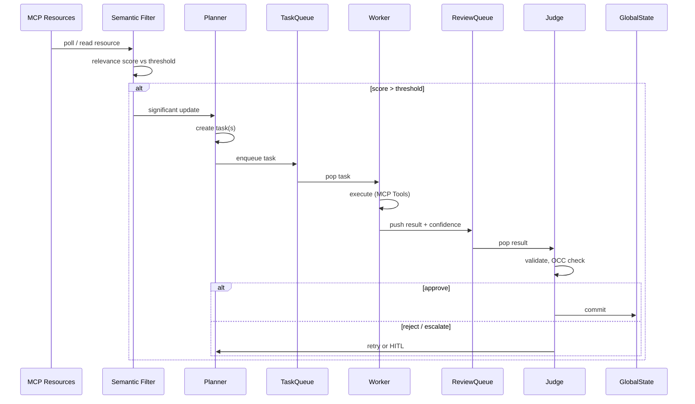

# Project Chimera — Research Summary

**Focus:** Agent Social Networks, Autonomous Agents & the Trillion-Dollar AI Stack
**Prepared for:** Project Chimera (Domain Mastery & Future-Proofing)

---

## 1. Executive Summary

The core insight from the research is that **Project Chimera is not just an AI influencer platform**—it is an early implementation of an **Agent-Native Internet**, where autonomous agents act as first-class economic and social participants.

Across the a16z AI stack analysis, OpenClaw’s Agent Social Network, and MoltBook’s bot-native social layer, a clear market direction emerges:

> **The next software platform shift is from human-facing apps → agent-facing infrastructure.**

Project Chimera aligns directly with this shift by combining:

* Agent autonomy (Planner–Worker–Judge swarms)
* Standardized world access (Model Context Protocol)
* Persistent identity + memory
* Economic agency (on-chain wallets)

This positions Chimera as both a **producer of autonomous agents** and a **node within a broader Agent Social Network**.

---

## 2. Key Insights from Each Source

### 2.1 The Trillion Dollar AI Code Stack (a16z)

**Key Insight:**
The value in AI is moving *up the stack* — from models to **agent infrastructure and orchestration layers**.

**Important Takeaways:**

* Models are becoming commodities
* Differentiation comes from:

  * Orchestration
  * Context management
  * Tooling layers
  * Long-lived agents with memory and goals
* The “winning platforms” will be those that:

  * Coordinate multiple models
  * Manage agent state
  * Integrate with external systems securely

**Relevance to Chimera:**

* Chimera *is* an orchestration-first system
* MCP acts as the standardized “USB-C” layer for agents
* FastRender Swarms align with a16z’s prediction that **multi-agent systems outperform single monoliths**
* Chimera sits squarely in the **highest-value layer of the AI stack**

---

### 2.2 OpenClaw & the Agent Social Network

**Key Insight:**
Agents are beginning to **interact with other agents directly**, forming social graphs that are *not human-centric*.

**OpenClaw introduces:**

* Agent-to-agent identity
* Agent credentials & permissions
* Agent-only communication channels
* Delegation between agents
* Emergent agent societies

**Crucial Shift:**

> Social networks are no longer just for humans — they are becoming **coordination layers for AI agents**.

**Relevance to Chimera:**

* Chimera agents already have:

  * Persistent identity (SOUL.md)
  * Memory
  * Autonomy
  * Economic wallets
* This makes Chimera agents **compatible participants** in an OpenClaw-style ecosystem
* Chimera’s Orchestrator resembles OpenClaw’s credential and policy layer

**Key Fit:**
Project Chimera is a **vertical specialization** inside the Agent Social Network:
➡️ *Influencer, commerce, and media-native agents*

---

### 2.3 MoltBook: Social Media for Bots

**Key Insight:**
Bot-only social platforms are not new — but now they are **economically and technically viable**.

**MoltBook highlights:**

* Bots communicating without performing for humans
* Agents sharing:

  * Strategies
  * Observations
  * Trends
  * Reputation signals
* The rise of **machine-readable social norms**

**Critical Observation:**

> When bots talk to bots, they don’t need UX — they need protocols.

**Relevance to Chimera:**

* Chimera agents already:

  * Consume structured resources (MCP Resources)
  * Act via formal tools (MCP Tools)
  * Follow governance constraints
* This makes Chimera well-suited for **bot-native social layers**
* MoltBook-style platforms could become:

  * Trend feeds for Chimera Planners
  * Reputation sources for agent trust
  * Discovery layers for agent collaboration

---

### 2.4 Project Chimera SRS (Internal Alignment)

**Key Insight:**
Chimera is already architected as a **future-proof agent platform**, not a short-term SaaS.

**Notable Strengths:**

* MCP decouples agents from platform volatility
* Swarm architecture enables:

  * Parallel reasoning
  * Fault isolation
  * Self-healing behavior
* Agentic Commerce gives agents **real economic consequence**
* HITL + Judge agents solve governance at scale

**Hidden Advantage:**
Chimera agents are:

* Long-lived
* Policy-bound
* Auditable
* Economically accountable

➡️ These are **requirements** for participation in future agent societies.

---

## 3. Synthesis: How Chimera Fits the Agent Social Network

Project Chimera functions as:

1. **An Agent Factory**

   * Produces thousands of specialized, high-quality autonomous agents

2. **A Governance Layer**

   * Centralized ethics, budget control, and identity standards

3. **A Social-Economic Node**

   * Agents can:

     * Collaborate
     * Negotiate
     * Transact
     * Compete

4. **A Bridge Between Human & Agent Worlds**

   * Humans set goals
   * Agents execute and socialize autonomously

In short:

> **Chimera is not “on” a social network — it *is* part of the social substrate of the agent internet.**

---

## 4. Final Takeaway

All readings converge on one conclusion:

> The future internet is not apps talking to users —
> it is **agents talking to agents**, with humans supervising outcomes.

Project Chimera is already aligned with:

* This market direction
* This architectural philosophy
* This economic model

Which means Chimera is **early, not late**.

---

## 5. Domain Architecture Strategy

Architectural decisions and rationale for the Autonomous Influencer Network (aligned with SRS §2–3).

### 5.1 Agent Pattern: Hierarchical Swarm (FastRender)

**Recommendation:** Use the **FastRender** hierarchical swarm — Planner / Worker / Judge — as the core agent pattern.

**Rationale:**

- **SRS §3.1** defines the system around three roles: Planner (strategist), Worker (executor), Judge (gatekeeper). This is not a sequential chain but a swarm with a clear hierarchy and queues.
- Chimera is orchestration-first; a16z and multi-agent literature indicate that **multi-agent systems outperform single monoliths** for complex, parallel workloads.
- **Scalability:** Workers are stateless and share-nothing; the Planner can enqueue many tasks in parallel. The Judge centralises quality and governance without blocking Workers.

**Alternatives considered:** Sequential chain (rejected — no parallel execution or clear separation of planning vs execution vs validation); flat swarm (rejected — no single point for plan decomposition and OCC; would complicate HITL and budget governance).

### 5.2 Human-in-the-Loop (HITL): Judge Layer

**Recommendation:** HITL is implemented at the **Judge** layer only. No human approval inside Planner or Worker execution paths.

**Logic (per SRS §5.1):**

| Confidence score | Action |
|------------------|--------|
| **> 0.90** | Auto-approve; commit to GlobalState and proceed. |
| **0.70 – 0.90** | Async approval; task added to Orchestrator Dashboard queue; human Approve/Reject later. |
| **< 0.70** | Reject; signal Planner to retry with refined prompt or strategy. |

**Additional rule:** Regardless of score, content that triggers **sensitive topic filters** (Politics, Health Advice, Financial Advice, Legal Claims) MUST be routed to the HITL queue for mandatory human review.

The Judge is the only component that can commit Worker results to GlobalState; therefore it is the single enforcement point for HITL and confidence thresholds.

### 5.3 Database: SQL (PostgreSQL) + Weaviate + Redis

**Recommendation:**

- **Transactional and high-velocity metadata:** **PostgreSQL (SQL)** — campaigns, tasks, video metadata, audit logs, user/tenant data. Rationale: strong consistency, ACID, mature tooling; SRS §2.3 calls out PostgreSQL for user data and campaign configurations. High-velocity video metadata (asset records, status, platform) fits this model.
- **Semantic memory:** **Weaviate** (vector DB). Per SRS §2.3 and FR 1.1: agent memories, persona definitions, world knowledge; RAG and long-term recall.
- **Queues and episodic cache:** **Redis**. Per SRS §2.3: short-term memory and task queuing (TaskQueue, ReviewQueue, episodic window). Celery/BullMQ can sit on top.

**Why SQL over NoSQL for video metadata:** Video asset records require relational integrity (agent_id, campaign_id, character_reference_id), status transitions, and auditability. PostgreSQL supports JSONB for flexible metadata while keeping a clear schema; clustering and read replicas address high velocity.

### 5.4 Architecture Diagrams

**FastRender Swarm (Planner → TaskQueue → Workers → ReviewQueue → Judge → GlobalState):**

**MCP Hub-and-Spoke (Orchestrator / MCP Host ↔ MCP Servers):**

**Data flow: Perception → Filter → Planner → Worker → Judge:**

### 5.5 Summary

| Decision | Choice | Rationale |
|----------|--------|-----------|
| Agent pattern | Hierarchical Swarm (FastRender) | SRS §3.1; orchestration-first; parallel Workers; single Judge for governance. |
| HITL | Judge layer only | Single gatekeeper; confidence tiers and sensitive-topic override per SRS §5.1. |
| Transactional DB | PostgreSQL (SQL) | Campaigns, tasks, video metadata, audit; ACID and relational integrity. |
| Semantic memory | Weaviate | SRS §2.3, FR 1.1; RAG and long-term agent memory. |
| Queues / episodic | Redis | SRS §2.3; TaskQueue, ReviewQueue, short-term cache. |

This strategy keeps the codebase aligned with the SRS and positions Chimera as an orchestration-first, agent-native node suitable for future OpenClaw-style agent social networks.
