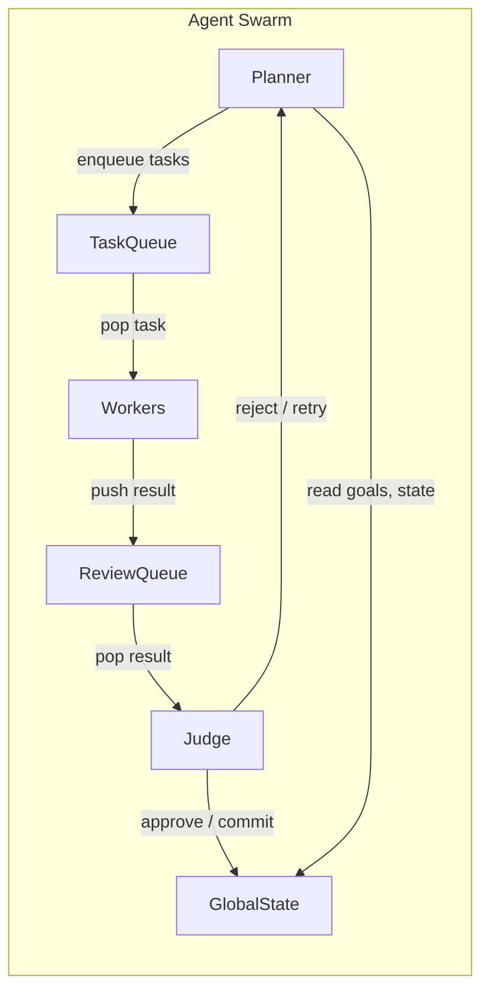
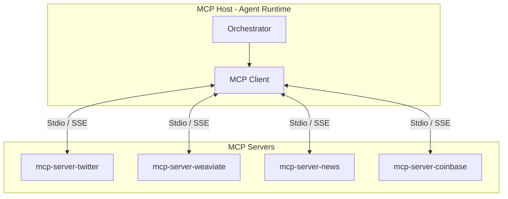
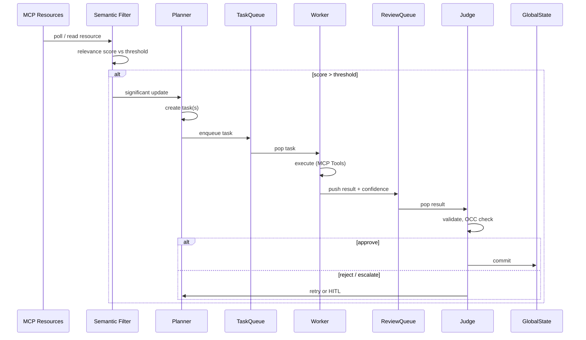

# Project Chimera — Research Summary

**Focus:** Agent Social Networks, Autonomous Agents & the Trillion-Dollar AI Stack
**Prepared for:** Project Chimera (Domain Mastery & Future-Proofing)

---

## 1. Executive Summary

The core insight from the research is that **Project Chimera is not just an AI influencer platform**—it is an early implementation of an **Agent-Native Internet**, where autonomous agents act as first-class economic and social participants.

Across the a16z AI stack analysis, OpenClaw’s Agent Social Network, and MoltBook’s bot-native social layer, a clear market direction emerges:

> **The next software platform shift is from human-facing apps → agent-facing infrastructure.**

Project Chimera aligns directly with this shift by combining:

* Agent autonomy (Planner–Worker–Judge swarms)
* Standardized world access (Model Context Protocol)
* Persistent identity + memory
* Economic agency (on-chain wallets)

This positions Chimera as both a **producer of autonomous agents** and a **node within a broader Agent Social Network**.

---

## 2. Key Insights from Each Source

### 2.1 The Trillion Dollar AI Code Stack (a16z)

**Key Insight:**
The value in AI is moving *up the stack* — from models to **agent infrastructure and orchestration layers**.

**Important Takeaways:**

* Models are becoming commodities
* Differentiation comes from:

  * Orchestration
  * Context management
  * Tooling layers
  * Long-lived agents with memory and goals
* The “winning platforms” will be those that:

  * Coordinate multiple models
  * Manage agent state
  * Integrate with external systems securely

**Relevance to Chimera:**

* Chimera *is* an orchestration-first system
* MCP acts as the standardized “USB-C” layer for agents
* FastRender Swarms align with a16z’s prediction that **multi-agent systems outperform single monoliths**
* Chimera sits squarely in the **highest-value layer of the AI stack**

---

### 2.2 OpenClaw & the Agent Social Network

**Key Insight:**
Agents are beginning to **interact with other agents directly**, forming social graphs that are *not human-centric*.

**OpenClaw introduces:**

* Agent-to-agent identity
* Agent credentials & permissions
* Agent-only communication channels
* Delegation between agents
* Emergent agent societies

**Crucial Shift:**

> Social networks are no longer just for humans — they are becoming **coordination layers for AI agents**.

**Relevance to Chimera:**

* Chimera agents already have:

  * Persistent identity (SOUL.md)
  * Memory
  * Autonomy
  * Economic wallets
* This makes Chimera agents **compatible participants** in an OpenClaw-style ecosystem
* Chimera’s Orchestrator resembles OpenClaw’s credential and policy layer

**Key Fit:**
Project Chimera is a **vertical specialization** inside the Agent Social Network:
➡️ *Influencer, commerce, and media-native agents*

---

### 2.3 MoltBook: Social Media for Bots

**Key Insight:**
Bot-only social platforms are not new — but now they are **economically and technically viable**.

**MoltBook highlights:**

* Bots communicating without performing for humans
* Agents sharing:

  * Strategies
  * Observations
  * Trends
  * Reputation signals
* The rise of **machine-readable social norms**

**Critical Observation:**

> When bots talk to bots, they don’t need UX — they need protocols.

**Relevance to Chimera:**

* Chimera agents already:

  * Consume structured resources (MCP Resources)
  * Act via formal tools (MCP Tools)
  * Follow governance constraints
* This makes Chimera well-suited for **bot-native social layers**
* MoltBook-style platforms could become:

  * Trend feeds for Chimera Planners
  * Reputation sources for agent trust
  * Discovery layers for agent collaboration

---

### 2.4 Project Chimera SRS (Internal Alignment)

**Key Insight:**
Chimera is already architected as a **future-proof agent platform**, not a short-term SaaS.

**Notable Strengths:**

* MCP decouples agents from platform volatility
* Swarm architecture enables:

  * Parallel reasoning
  * Fault isolation
  * Self-healing behavior
* Agentic Commerce gives agents **real economic consequence**
* HITL + Judge agents solve governance at scale

**Hidden Advantage:**
Chimera agents are:

* Long-lived
* Policy-bound
* Auditable
* Economically accountable

➡️ These are **requirements** for participation in future agent societies.

---

## 3. Synthesis: How Chimera Fits the Agent Social Network

Project Chimera functions as:

1. **An Agent Factory**

   * Produces thousands of specialized, high-quality autonomous agents

2. **A Governance Layer**

   * Centralized ethics, budget control, and identity standards

3. **A Social-Economic Node**

   * Agents can:

     * Collaborate
     * Negotiate
     * Transact
     * Compete

4. **A Bridge Between Human & Agent Worlds**

   * Humans set goals
   * Agents execute and socialize autonomously

In short:

> **Chimera is not “on” a social network — it *is* part of the social substrate of the agent internet.**

---

## 4. Final Takeaway

All readings converge on one conclusion:

> The future internet is not apps talking to users —
> it is **agents talking to agents**, with humans supervising outcomes.

Project Chimera is already aligned with:

* This market direction
* This architectural philosophy
* This economic model

Which means Chimera is **early, not late**.

---

## 5. Domain Architecture Strategy

Architectural decisions and rationale for the Autonomous Influencer Network (aligned with SRS §2–3). This section explicitly details the **chosen agent orchestration pattern** with justification, the **Human-in-the-Loop safety layer** design, and the **database strategy** with rationale.

---

### 5.1 Chosen Agent Orchestration Pattern: Hierarchical Swarm (FastRender)

**Chosen pattern:** **Hierarchical Swarm (FastRender)** — a three-role architecture comprising **Planner**, **Worker**, and **Judge**, coordinated via queues (TaskQueue, ReviewQueue) and a shared GlobalState.

**Explicit design:**

| Role | Responsibility | Data flow |
|------|----------------|-----------|
| **Planner** | Reads GlobalState (campaign goals, trends, budget); decomposes goals into a DAG of tasks; pushes tasks to TaskQueue; reacts to Judge rejections by re-planning. | Input: GlobalState, MCP Resources (perception). Output: Task payloads to TaskQueue. |
| **Worker** | Pops one task from TaskQueue; executes it using MCP Tools only; pushes a Result (artifact + confidence_score) to ReviewQueue. Stateless; no direct communication with other Workers. | Input: Task from TaskQueue. Output: Result to ReviewQueue. |
| **Judge** | Pops Result from ReviewQueue; validates against acceptance criteria, persona, and safety rules; applies Optimistic Concurrency Control (OCC) on commit. Either commits to GlobalState, re-queues for Planner (reject/retry), or escalates to HITL. | Input: Result from ReviewQueue. Output: GlobalState updates or HITL queue entries. |

Orchestration is **centralised in the Planner** (single point of plan decomposition) and **quality/governance centralised in the Judge** (single gatekeeper for commits). Workers scale horizontally without coordination.

**Justification for this pattern:**

1. **SRS alignment:** SRS §3.1 explicitly specifies Planner, Worker, and Judge with the above responsibilities. Adopting FastRender ensures traceability to the authoritative spec.
2. **Parallelism and scale:** A single Planner can enqueue hundreds of tasks (e.g. “reply to 50 comments”); Workers consume in parallel. A sequential chain would serialise execution and become a bottleneck.
3. **Separation of concerns:** Planning (what to do), execution (doing it), and validation (did we do it right) are distinct. Mixing them in one monolith increases cognitive load and makes governance (HITL, budget) harder to enforce.
4. **Fault isolation:** A failing Worker does not bring down the Planner or Judge; the Judge can reject the result and the Planner can retry or re-plan.

**Alternatives considered and rejected:**

- **Single monolithic agent:** Rejected — no parallelism, no clear validation gate, and governance (HITL, OCC) would be scattered.
- **Sequential chain (Plan → Execute → Validate in one pipeline):** Rejected — no parallel Worker pool; throughput would not meet SRS targets (e.g. 1,000 concurrent agents).
- **Flat swarm (peer-to-peer agents):** Rejected — no single point for plan decomposition or for enforcing OCC and HITL; budget and safety would require distributed consensus, adding complexity without benefit for this use case.

---

### 5.2 Human-in-the-Loop (HITL) Safety Layer — Design

**Design principle:** The HITL safety layer is implemented **only at the Judge**. No human approval is required inside the Planner or Worker execution paths. The Judge is the **single enforcement point** for quality and safety before any Worker output affects GlobalState or the outside world.

**Components of the HITL design:**

1. **Confidence scoring:** Every Worker output includes a `confidence_score` (0.0–1.0), produced by the model or a dedicated scoring step. This score is the primary input for routing.
2. **Automated routing (Judge):** The Judge routes each Result according to the table below. Only two outcomes bypass immediate human review: **auto-approve** (high confidence) and **reject/retry** (low confidence, no human needed to reject).
3. **HITL queue and dashboard:** Results in the medium-confidence band and all sensitive-topic results are written to an **HITL queue** consumed by the **Orchestrator Dashboard**. Humans (reviewers) see pending items and can Approve, Reject, or Edit. Approved items are committed to GlobalState by the system; rejected items signal the Planner to retry or drop.
4. **Sensitive-topic override:** A **sensitive topic filter** (keyword or semantic) runs on every Result. If the content matches Politics, Health Advice, Financial Advice, or Legal Claims, the Result is **always** sent to the HITL queue, regardless of confidence. This satisfies “mandatory human review” for high-risk domains (SRS NFR 1.2).

**Routing logic (explicit design):**

| Confidence score | Judge action | Human in the loop? |
|------------------|--------------|---------------------|
| **> 0.90** | Auto-approve; commit to GlobalState; trigger next steps. | No. |
| **0.70 – 0.90** | Do not commit immediately; add Result to Orchestrator Dashboard (HITL queue). Agent continues other work; this action stays pending until human Approve/Reject. | Yes (async). |
| **< 0.70** | Reject; do not commit; signal Planner to retry with refined prompt or strategy. | No (automated reject). |
| **Any score + sensitive topic** | Do not auto-approve; add Result to HITL queue for mandatory human review. | Yes. |

**Rationale for thresholds:**

- **0.90:** High confidence indicates the output is likely aligned with persona and safety; auto-approve keeps velocity high for the majority of cases.
- **0.70–0.90:** Uncertainty is material; human review catches edge cases without blocking the agent on every task.
- **< 0.70:** Low confidence suggests the task or prompt should be improved; retry is more useful than human review of clearly weak output.

**Placement at Judge only:** The Judge is the only component that can write to GlobalState from Worker results. Therefore, all approval paths (auto or human) go through the Judge. This avoids duplicated safety logic and ensures a single audit trail for “who approved what.”

---

### 5.3 Database Strategy — Proposal and Rationale

**Proposal:** Use a **three-store strategy** — **PostgreSQL** for transactional and high-velocity metadata, **Weaviate** for semantic memory, and **Redis** for queues and episodic cache. No single database is used for all workloads.

**Explicit assignment and rationale:**

| Store | Data assigned | Rationale |
|-------|----------------|------------|
| **PostgreSQL (SQL)** | User/tenant data; campaign definitions; task and result records (audit); **video asset metadata** (id, agent_id, task_id, platform, tier, character_reference_id, status, created_at, metadata JSONB). | **Consistency and auditability:** Campaigns, tasks, and video assets have relational integrity (e.g. video_assets.agent_id → agents, task_id → tasks). ACID and foreign keys prevent orphaned or inconsistent records. **Scale:** PostgreSQL supports read replicas and partitioning; high-velocity writes to video_assets can be batched or sharded by agent_id. SRS §2.3 explicitly specifies PostgreSQL for user data and campaign configurations; extending to video metadata keeps all transactional and audit data in one SQL model. |
| **Weaviate (vector DB)** | Agent long-term memories; persona embeddings; world knowledge used for RAG. | **Semantic search:** SRS FR 1.1 requires “query Weaviate for semantic matches” for long-term recall. Relational DBs are not optimised for nearest-neighbour search over embeddings. Weaviate (or similar) is the right tool for RAG and “what the agent remembers.” |
| **Redis** | TaskQueue; ReviewQueue; short-term (episodic) conversation history; session or rate-limit state. | **Throughput and latency:** Queues require fast push/pop and optional TTL. Redis is in-memory and supports list/stream structures; SRS §2.3 specifies Redis for short-term memory and task queuing. Episodic cache (e.g. last 1 hour) fits Redis; no need for durable SQL for this. |

**Why SQL (PostgreSQL) over NoSQL for video metadata:**

- **Relational integrity:** Video assets belong to an agent and a task; campaigns aggregate tasks. Foreign keys enforce referential integrity and simplify joins for reporting and compliance.
- **Status and audit:** Status transitions (draft → judge_pending → approved → published) and timestamps are easy to model and query in SQL; JSONB allows flexible metadata without sacrificing schema for core fields.
- **Operational maturity:** PostgreSQL has mature backup, replication, and tooling; scaling via read replicas or connection pooling is well understood. NoSQL would push schema and consistency into application code and complicate audits.

**Why not a single database:** Mixing queues and vector search into PostgreSQL would either overload it (queues) or underuse it (vectors). Separating by workload (transactional vs semantic vs queue) lets each store be tuned and scaled appropriately and aligns with SRS §2.3.

### 5.4 Architecture Diagrams

**FastRender Swarm (Planner → TaskQueue → Workers → ReviewQueue → Judge → GlobalState):**

**MCP Hub-and-Spoke (Orchestrator / MCP Host ↔ MCP Servers):**

**Data flow: Perception → Filter → Planner → Worker → Judge:**

### 5.5 Summary

| Decision | Choice | Rationale |
|----------|--------|-----------|
| Agent orchestration pattern | Hierarchical Swarm (FastRender) | SRS §3.1; explicit Planner/Worker/Judge roles; parallelism and fault isolation; single Judge for governance. |
| HITL safety layer | Judge-only; confidence tiers + sensitive-topic override | Single enforcement point; auto-approve / async HITL / reject bands; mandatory human review for sensitive topics per SRS §5.1. |
| Transactional DB | PostgreSQL (SQL) | Campaigns, tasks, video metadata, audit; ACID and relational integrity. |
| Semantic memory | Weaviate | SRS §2.3, FR 1.1; RAG and long-term agent memory. |
| Queues / episodic | Redis | SRS §2.3; TaskQueue, ReviewQueue, short-term cache. |

This strategy keeps the codebase aligned with the SRS and positions Chimera as an orchestration-first, agent-native node suitable for future OpenClaw-style agent social networks. The **agent orchestration pattern** is explicitly chosen and justified (§5.1); the **HITL safety layer** is designed with clear components, routing logic, and threshold rationale (§5.2); and the **database strategy** is proposed with explicit data assignment and rationale for each store (§5.3).
